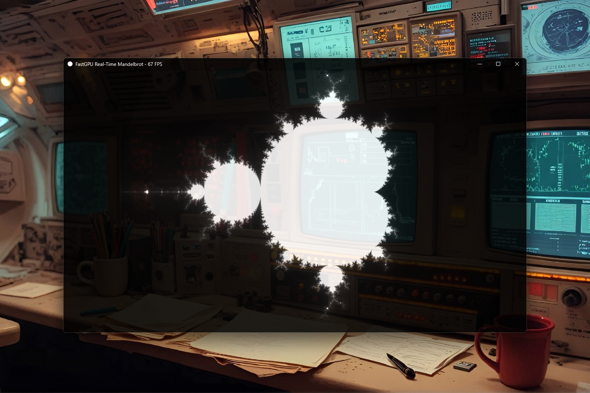

# FastGPU — High-Performance Native GPU Acceleration for Java [v0.1.0]

[](https://github.com/andrestubbe/FastGPU/releases/tag/v0.1.0)
[](https://opensource.org/licenses/MIT)
[](https://www.java.com)
[]()
[](https://jitpack.io/#andrestubbe)

---

**⚡ Advanced GPU-accelerated computing and rendering for the FastJava ecosystem. Harness the power of DirectX, OpenCL, and
Vulkan directly from Java.**

FastGPU provides a high-performance bridge to modern graphics APIs for complex parallel computations and real-time rendering.
---

[](https://www.youtube.com/watch?v=BZsqQl7WqWk)

---


## Table of Contents

- [Features](#features)
- [Installation](#installation)
- [License](#license)

---

## Features

- **🎮 DirectX Integration**: High-speed rendering and compute via D3D11/D3D12.
- **⚡ OpenCL Support**: Cross-platform GPU-accelerated parallel computing.
- **📦 Zero-Copy Buffers**: Efficient data sharing between CPU and GPU.
- **🚀 High Throughput**: Optimized for real-time vision and rendering pipelines.

---

## Installation

### Option 1: Maven (Recommended)

Add the JitPack repository and the dependencies to your `pom.xml`:

```xml

<repositories>
    <repository>
        <id>jitpack.io</id>
        <url>https://jitpack.io</url>
    </repository>
</repositories>

<dependencies>
<!-- FastGPU Library -->
<dependency>
    <groupId>com.github.andrestubbe</groupId>
    <artifactId>fastgpu</artifactId>
    <version>v0.1.0</version>
</dependency>

<!-- FastCore (Required Native Loader) -->
<dependency>
    <groupId>com.github.andrestubbe</groupId>
    <artifactId>fastcore</artifactId>
    <version>v0.1.0</version>
</dependency>
</dependencies>
```

### Option 2: Gradle (via JitPack)

```groovy
repositories {
    maven { url 'https://jitpack.io' }
}

dependencies {
    implementation 'com.github.andrestubbe:fastgpu:v0.1.0'
    implementation 'com.github.andrestubbe:fastcore:v0.1.0'
}
```

### Option 3: Direct Download (No Build Tool)

Download the latest JARs directly to add them to your classpath:

1. 📦 **[fastgpu-v0.1.0.jar](https://github.com/andrestubbe/FastGPU/releases/download/v0.1.0/fastgpu-v0.1.0.jar)** (The
   Core Library)
2. ⚙️ **[fastcore-v0.1.0.jar](https://github.com/andrestubbe/FastCore/releases/download/v0.1.0/fastcore-v0.1.0.jar)** (
   The Mandatory Native Loader)

---

## Documentation

* **[COMPILE.md](COMPILE.md)**: Full compilation guide (MSVC C++17 build chain + JNI Setup).
* **[REFERENCE.md](REFERENCE.md)**: Full API descriptions, border configurations, and codepoint index.
* **[PHILOSOPHIE.md](PHILOSOPHIE.md)**: The engineering rationale for zero-allocation performance.
* **[ROADMAP.md](ROADMAP.md)**: Future milestones and planned features.

---

## Platform Support

| Platform      | Status            |
|---------------|-------------------|
| Windows 10/11 | ✅ Fully Supported |
| Linux         | 🚧 Planned        |
| macOS         | 🚧 Planned        |

---

## License

MIT License — See [LICENSE](LICENSE) for details.

---

## Related Projects

- [FastCore](https://github.com/andrestubbe/FastCore) — Native Library Loader for Java
- [FastAudioPlayer](https://github.com/andrestubbe/FastAudioPlayer) — Native Windows WASAPI Audio Playback for Java
- [FastTTS](https://github.com/andrestubbe/FastTTS) — High-Performance Native Windows TTS API for Java
- [FastSTT](https://github.com/andrestubbe/FastSTT) — Ultra-Fast Native Speech-to-Text for Java
- [FastWakeWord](https://github.com/andrestubbe/FastWakeWord)

---

**Part of the FastJava Ecosystem** — *Making the JVM faster. Small package. Maximum speed. Zero bloat. 🚀📋*

